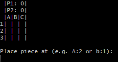

# Tic Tac Toe

## Demo & Snippets



## Purpose
To create tic tac toe CLI game.
To practise and implement my knowledge of Rust.
For educational purposes I will be trying to implement as many techniques of rust as I can regardless if it is efficent or not.


## Build Steps

1. download the main.exe file

2. double click to start program 

OR

open up the terminal
navigate to the folder main.exe is located in

and use the command below depending on your OS

```
./main # Linux and MacOS
```

OR
```
.\main.exe # Windows
```


## Design Goals / Approach

Recreation of tic tac toe in the cli


## Features

- 3x3 board
- User will be prompted to enter co ordinates, e.g. (A:2, B:3)
- Restart, reset scores and exit command options
- Score Tracker
- Testing


<!-- ## Known issues

-   Remaining bugs, things that have been left unfixed
-   Features that are buggy / flimsy

--- -->

## Future Goals

- Allow users to customise there names instead of player 1 and player 2.
- Make an Omok version, 19x19 board 5 in a row wins
- ~~Restart, reset scores and exit command options~~
- ~~Score tracker~~
- ~~Testing~~


## Change logs

### 28/08/2023 | Project Creation
 Start of the project was a little bit bump, even though i read the documentation and followed along with the [lessons](https://doc.rust-lang.org/book/). I still had trouble figuring out the syntax, luckily the compiler was very helpful in telling me what I have to change inorder to make it compile. This just further solidifies the fact that I need to practise anything to fully understand the concepts, because just reading the theory and doing some code alongs dont cement the ideas properly.

 Other than syntax I have having a quite enjoyable time creating a rust program.

### 29/06/23023 | Practising using enums

 Initally I had been returning and using a bool value for the is_valid variable, but I wanted to practise using enums and the match operator. So I changed the placePiece function to return an enum which I feel allows me for more customisation when returning the function. Before I had only two options, but now I can have as many as I want allowing me to scale the program. 

### 01/07/2023 | Check win function, changing from bool to enums

 Completed the check win function, but it feels a little bit too verbose. I wonder if there is a way for me to check it without creating several references to the board state. But other than it being too verbose, it works i just dont know how efficient it is.

 I have also changed all the bools that where checking for certain conditions to enum's for the same reasons as stated on the 29th.

### 03/07/2023 | Refactoed and debugged some functions, created new ones

- Debugged the is_all_true function, removed useless code from ther functions.
- Saved the scores on the board struct, created a method on the board struct to increment scores based on player victory.
- Allowed the user to exit and restart from the board or application
- Created a third loop within the main function to loop

### 07/07/2023 | Implemented Testing and Refactored code and using getters and setters

Finally learnt how to create tests in rust, so i start on create some tests. So far they have been pretty simple tests,
and quite enjoyable to write because it is very simple compared to writing tests in javascript I feel, as it is less verbose. I will complete the other tests later because i got distracted trying to change the public struct variables to private, using getters and setters. 

Because of Java, I already had an introduction to getters and setters, but because my code heavily relied upon using public variables it was difficult trying to refactor the code and remembering what the code did even though it has only been 4 days. I was particularly confused on updating a struct within a struct, then i used the solution of using a setter for the inner struct and then using another setter to update the parent struct, there is probably a more efficient way of doing this, so i will muck around and test some things but now everything has been refactored to what I think makes more sense from a readability point of view.

### 12/07/2023 | Finished Implementing the tests

I have finally finished creating all the tests for the project, I initially had a script for testing the player script but I am not too sure how to go about mocking user input. Because one of my functions requires waiting for the user to input something, this might be something I get back to once I delve deeper into rust.


## What did you struggle with?

Since this is my first project in rust I struggled with almost everything, i struggled with understanding with types to use i32 and usize for arrays, enums, creating path modules for scripts, to only name a few. Although I did struggle I feel like I was able to finish this project and implement all of my current rust knowledge as of this moment.
